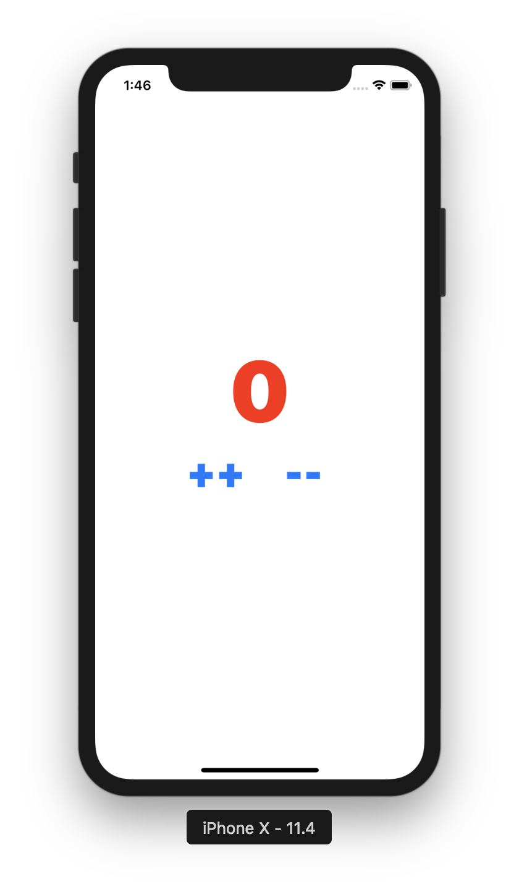
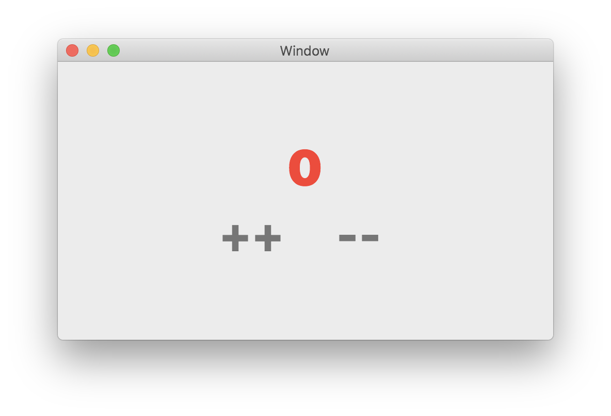

# Mvce — Event driven MVC

**/myo͞oz/**

An event driven MVC library to glue decoupled Model, View, and Controller for UIKit/AppKit. Minimal, simple, and unobtrusive.

本文档同时提供[简体中文版](README.zh_CN.md)。

## Why

UIKit/AppKit is mainly about view. Don't be misled by the `Controller` in `UIViewController`/`NSViewController` and descendants, they are all views, should be avoided things that belong to controller, such as networking, model updating.

How to glue view, model, and controller is upon to you, UIKit/AppKit has no strong options on that. Typically, as the (bad) official examples show to us, we define a model, refer it inside `UIViewController`/`NSViewController`s, and manipulate the model directly. It works like a...charm?

No, it's MVC without C, it's strong coupling, it's not reusable(for crossing UIKit and AppKit), if you care, it's also untestable.

## How

The key idea of MVC is separation for Model, View, and Controller. To glue 'em, Mvce provides an alternative way.

Let's take a taste of Mvce first, here is a simple counter app:



All code shows below:

```swift
// Model to represent count
final class CounterModel: NSObject {
  @objc dynamic var count = 0
}

// Event to represent behavior for button ++ and --
enum CounterEvent {
  case increment
  case decrement
}

// Controller to represent how to update model
struct CounterController: Mvce.Controller {
  typealias Model = CounterModel
  typealias Event = CounterEvent

  func update(model: CounterModel, for event: CounterEvent, eventEmitter: @escaping (Event) -> Void) {
    switch event {
    case .increment:
      model.count += 1
    case .decrement:
      model.count -= 1
    }
  }
}

// For button actions
class ButtonAction: NSObject {
  let emit: (CounterEvent) -> Void

  init(emit: @escaping (CounterEvent) -> Void) {
    self.emit = emit
  }

  @objc func incr(_ sender: Any?) {
    emit(.increment)
  }

  @objc func decr(_ sender: Any?) {
    emit(.decrement)
  }
}

// View to represent model state, and emit event to notify controller to update model
final class ViewController: UIViewController {
  @IBOutlet weak var label: UILabel!
  @IBOutlet weak var incrButton: UIButton!
  @IBOutlet weak var decrButton: UIButton!

  override func viewDidLoad() {
    super.viewDidLoad()
    // Don't forget to glue 'em all here
    // And don't worry, lifetime is managed
    Mvce.glue(model: CounterModel(), view: self, controller: CounterController())
  }
}

// Adopt `View` protocol to bind model and event emitter.
extension ViewController: Mvce.View {
  typealias Model = CounterModel
  typealias Event = CounterEvent

  func bind(model: CounterModel) -> Invalidator {
    return Mvce.flatKVObservations([
      model.bind(\.count, to: label, at: \.text) { String(format: "%d", $0) }
    ])
  }

  func bind(eventEmitter: @escaping (CounterEvent) -> Void) {
    let action = ButtonAction(emit: eventEmitter)
    incrButton.addTarget(action, action: #selector(action.incr(_:)), for: .touchUpInside)
    decrButton.addTarget(action, action: #selector(action.decr(_:)), for: .touchUpInside)
    // Hack to retain target
    let key: StaticString = #function
    objc_setAssociatedObject(self, key.utf8Start, action, .OBJC_ASSOCIATION_RETAIN_NONATOMIC)
  }
}
```

### Decouple View and Model

Take a careful look at our `ViewController`, there's no any reference to model! Just adopt `View` protocol and bind model's count to label inside `func bind(model:) -> Invalidator`. Mvce provides some wrapper for `func observe<Value>(_ keyPath: KeyPath<Self, Value>, options: NSKeyValueObservingOptions = default, changeHandler: @escaping (Self, NSKeyValueObservedChange<Value>) -> Void) -> NSKeyValueObservation`, KVO has never been such easier.

```swift
public extension NSObjectProtocol where Self : NSObject {
  func bind<V, V2, T>(_ keyPath: KeyPath<Self, V>, transform: @escaping (V) -> V2, to target: T, using binder: @escaping (T, V2) -> Void) -> NSKeyValueObservation
  func bind<V, T>(_ keyPath: KeyPath<Self, V>, to target: T, using binder: @escaping (T, V) -> Void) -> NSKeyValueObservation
  func bind<V, T, U>(_ keyPath: KeyPath<Self, V>, to target: T, at targetKeyPath: ReferenceWritableKeyPath<T, U>, transform: @escaping (V) -> U) -> NSKeyValueObservation
  func bind<V, T>(_ keyPath: KeyPath<Self, V>, to target: T, at targetKeyPath: ReferenceWritableKeyPath<T, V>) -> NSKeyValueObservation
}
```

Mvce manages the observation lifetime, once you return an invalidation closure `() -> Void` which Mvce typealias to `Invalidator`. Mvce also provides `static func flatKVObservations(_ observations: [NSKeyValueObservation]) -> Invalidator` to flat multiple observations to an `Invalidator`.

### Decouple View and Controller

There is no any reference to controller inside view too! `View` protocol also requires you bind event emitter. What's an event emitter? Just a closure `(Event) -> Void`, you can use it to emit event, Mvce will dispatch event to controller and inform it to update model.

### Glue Model, View, and Controller together

Glue 'em all with `Mvce.glue(model:view:controller:)`, inject to `loadView` or `viewDidLoad` in `UIViewController`/`NSViewController`. And lifetime is managed by Mvce.

### Cross-Platform (iOS & macOS)?

Sure, that's _REAL_ MVC's advantage! Model and Controller can be shared, only platform-independent view is required to rewrite.

```swift
class ViewController: NSViewController {
  @IBOutlet weak var label: NSTextField!
  @IBOutlet weak var incrButton: NSButton!
  @IBOutlet weak var decrButton: NSButton!

  override func viewDidLoad() {
    super.viewDidLoad()
    Mvce.glue(model: CounterModel(), view: self, controller: CounterController())
  }
}

extension ViewController: Mvce.View {
  typealias Model = CounterModel
  typealias Event = CounterEvent

  func bind(model: CounterModel) -> Invalidator {
    return Mvce.flatKVObservations([
      model.bind(\.count, to: label, at: \.stringValue) { String(format: "%d", $0) }
    ])
  }

  func bind(eventEmitter: @escaping (CounterEvent) -> Void) {
    let action = ButtonAction(emit: eventEmitter)
    incrButton.target = action
    incrButton.action = #selector(action.incr(_:))
    decrButton.target = action
    decrButton.action = #selector(action.decr(_:))
    // hack to retain target
    let key: StaticString = #function
    objc_setAssociatedObject(self, key.utf8Start, action, .OBJC_ASSOCIATION_RETAIN_NONATOMIC)
  }
}
```



That's it! Remember to check out [Example](Example) directory for a more complex one.

### `EventEmitter` protocol

If you really, really need to access event emitter anywhere in View or Controller, just adopt `EventEmitter`. This's last resort, I don't recommend this way, it's easily to mess up code, violate MVC rules.

## License

MIT

## Author

- Blog: [realazy.com](https://realazy.com) (Chinese)
- Github: [@cxa](https://github.com/cxa)
- Twitter: [@\_cxa](https://twitter.com/_cxa) (Chinese mainly)
